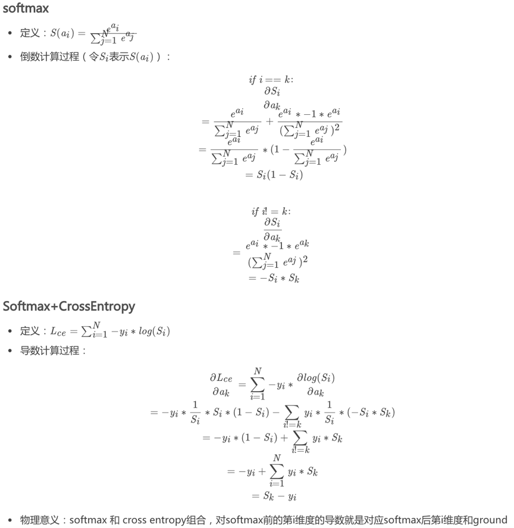

### 计算机视觉岗常见面试题

#### 问题：Softmax+Cross Entropy反向求导


#### 问题：BatchNorm层的详细解读(具体可以参考之后出版的百面深度学习2333)
  + 
  + 作用：
    - 使得每层的输入/输出分布更加稳定，避免参数更新和网络层次变深大幅度影响数据分布。从而使模型训练更稳定。
  + 参数 β 和 γ的作用
    + 保留网络各层在训练过程中的学习成果
    + 保证激活单元的非线性表达能力 
    + 使批归一化模块具有复原初始输出分布能力。

  + BN放在激活层之前还是之后 
  + 各种不同的Norm
  + [阅读材料](https://zhuanlan.zhihu.com/p/33173246)


#### 问题：Conv+BN加速策略
在inference阶段，可以将BN层的参数合并在之前的Linear或Conv层中，加速推断时间（因为二者都是线性变换）。
```python
w = module.weight.data
b = module.bias.data      # conv的bias可以用全0代替
ws = [1] * len(w.size())
ws[0] = w.size()[0]

invstd = bn_module.running_var.clone().add_(bn_module.eps).pow_(-0.5)
w.mul_(invstd.view(*ws).expand_as(w))
b.add_(-bn_module.running_mean).mul_(invstd)

if bn_module.affine:
    w.mul_(bn_module.weight.data.view(*ws).expand_as(w))
    b.mul_(bn_module.weight.data).add_(bn_module.bias.data)

```

#### 问题：目标检测里如何有效解决常见的前景少背景多的问题
  - 采用Focal Loss或OHEM进行负样本挖掘，加大Hard Example损失权重
  - 训练时只利用Ground Truth周边的Prior Boxes进行训练，忽略其他背景区域，只考虑困难背景区域

#### 问题：ROIPool和ROIAlign的区别，以及ROIAlign的简单实现（不考虑并行，cpu串行即可）
+ ROIPool存在两次量化误差，首先是将候选框边界量化为整数点坐标值，其次是将量化后的边界区域平均分割成 k x k 个单元，对每一个单元的边界进行量化。ROIAlign通过双线性插值避免了量化操作，保存了原始ROI的空间分布，有效避免了误差的产生；对于检测图片中大目标物体时，两种方案的差别不大，而如果是图片中有较多小目标物体需要检测，则优先选择ROIAlign，更精准一些

#### 问题: 斜着的矩形框如何求iou, 两个多边形的框如何求iou
首先要求解两个多边形的面积，方法见该[链接](https://www.shuxuele.com/geometry/area-irregular-polygons.html)

关键在于如何求出交集的面积

**思路一**

蒙特卡洛 + 采样，近似求解交集的面积，但是中间涉及判断点在不在多边形内，[判断点是否在多边形内](https://www.jianshu.com/p/ba03c600a557)

**思路二**

适合于两个凸多边形（非凸没想到好的思路），凸多边形可以看做是半平面的交集，因此两个凸多边形的交集，可以看作是（m+n）个半平面的交集（假设两个凸多边形分别有m个顶点和n个顶点），求出来半平面的交集（仍旧是一个凸多边形）之后，求解该多边形的面积即可。[求解半平面交集](https://www.cnblogs.com/Harry-bh/p/9998850.html)

#### 问题：BN在training和inference的时候有什么区别
+ 在训练时，我们可以计算出batch的均值和方差，迭代训练过程中，均值和方差一直在发生变化。但是在推理时，均值和方差是固定的，对于均值来说直接计算所有batch u值的平均值，对于标准偏差采用每个batch σB的无偏估计。

